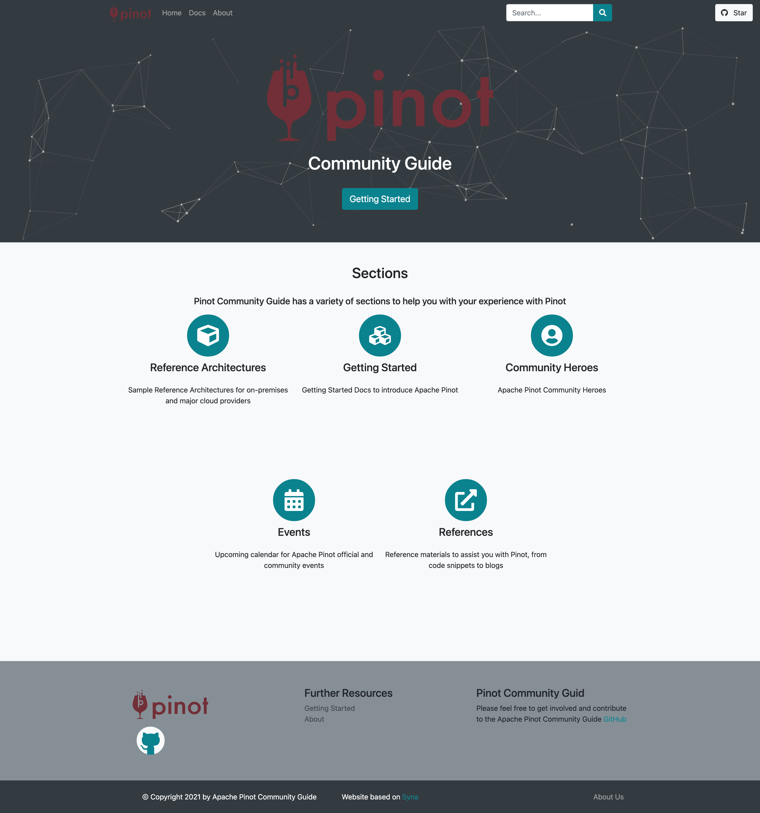

# pinot-community-guide
Apache Pinot Community Guide

This repository is an outline plan for the Apache Pinot Community Guide.



To get started and contribute you will need to install [Hugo extended](https://gohugo.io/) then simply:
```bash
git clone --recurse-submodules https://github.com/gregsimons/pinot-community-guide
```

To run 
```bash
    hugo server -D
```